# Huisstijl-onderzoek NEO Radio website

| | |
| --- | --- |
| **Onderzochte website** | [neoradio.nl](https://www.neoradio.nl) |
| **Datum onderzoek** | 30 september 2026 |
| **Doel** | Vastleggen hoe de huisstijl van NEO Radio er nu uitziet, zodat de app dezelfde uitstraling krijgt |

## Inhoud

1. [Werkwijze](#1-werkwijze)
2. [Screenshots](#2-screenshots)
3. [Logo en favicon](#3-logo-en-favicon)
4. [Kleuren](#4-kleuren)
5. [Typografie](#5-typografie)
6. [Beeldgebruik en iconen](#6-beeldgebruik-en-iconen)
7. [Layout en navigatie](#7-layout-en-navigatie)
8. [Tone of voice](#8-tone-of-voice)
9. [Doelgroep](#9-doelgroep)
10. [Sterke en zwakke punten](#10-sterke-en-zwakke-punten)
11. [Conclusie: wat nemen we mee naar de app?](#11-conclusie-wat-nemen-we-mee-naar-de-app)

---

## 1. Werkwijze

- **Kleuren** zijn niet met een color picker van een screenshot afgelezen, maar rechtstreeks uit de
  broncode (CSS) van de website gehaald. De logokleuren zijn per pixel gemeten in het originele
  logobestand. Dat is nauwkeuriger dan een color picker, omdat screenshots door compressie en het
  kleurprofiel van je scherm een paar tinten kunnen afwijken.
- **Typografie** (fonts, groottes, diktes) komt ook uit de CSS van de website.
- **Inhoud, menu en teksten** zijn bekeken op de homepage en de pagina's *Live luisteren*,
  *Live kijken*, *Live score*, *Medewerkers* en een recent nieuwsbericht.
- **Screenshots** van 8 pagina's (desktop en mobiel) zijn gebruikt om te controleren hoe de site er
  echt uitziet. Daarop zijn de kleuren nagemeten. Die metingen komen overeen met de CSS (zie
  [4. Kleuren](#4-kleuren)).
- **Logo, favicon en voorbeeldbeelden** zijn gedownload van de website (zie de submappen).

De website is gebouwd in **WordPress** met het thema **GeneratePress** (versie 3.6.1) en de
pagina-bouwer **Kadence Blocks**. In september 2026 is een nieuw menu ("Menu 2026") en een
vernieuwde homepage geplaatst. Een deel van de oudere thema-instellingen is nog actief; waar dat
voor verschillen zorgt, staat het hieronder.

---

## 2. Screenshots

De screenshots zijn gemaakt op 30 september 2026 in een gewone browser op Windows (desktop:
1907 px breed, mobiel: 349 px breed). Ze staan in [`screenshots/`](screenshots/). Klik op een
pagina om de screenshot te openen. Bij de menu-screenshot is de Windows-taakbalk eraf geknipt.

| Pagina | Desktop | Mobiel |
| --- | --- | --- |
| Homepage | [homepage-desktop](screenshots/2026-09-30-homepage-desktop.png) | [homepage-mobiel](screenshots/2026-09-30-homepage-mobiel.png) |
| Menu open | [menu-desktop](screenshots/2026-09-30-menu-desktop.png) | [menu-mobiel](screenshots/2026-09-30-menu-mobiel.png) |
| Nieuwsoverzicht | [nieuws-desktop](screenshots/2026-09-30-nieuws-desktop.png) | [nieuws-mobiel](screenshots/2026-09-30-nieuws-mobiel.png) |
| Nieuwsbericht | [nieuwsbericht-desktop](screenshots/2026-09-30-nieuwsbericht-desktop.png) | [nieuwsbericht-mobiel](screenshots/2026-09-30-nieuwsbericht-mobiel.png) |
| Live score | [live-score-desktop](screenshots/2026-09-30-live-score-desktop.png) | [live-score-mobiel](screenshots/2026-09-30-live-score-mobiel.png) |
| Live luisteren | [live-luisteren-desktop](screenshots/2026-09-30-live-luisteren-desktop.png) | [live-luisteren-mobiel](screenshots/2026-09-30-live-luisteren-mobiel.png) |
| Live kijken | [live-kijken-desktop](screenshots/2026-09-30-live-kijken-desktop.png) | [live-kijken-mobiel](screenshots/2026-09-30-live-kijken-mobiel.png) |
| Over NEO / Medewerkers | [medewerkers-desktop](screenshots/2026-09-30-medewerkers-desktop.png) | [medewerkers-mobiel](screenshots/2026-09-30-medewerkers-mobiel.png) |

> **Let op bij het lezen van de screenshots van hele pagina's:** een carrousel of animatie kan
> tijdens het maken van de screenshot verschuiven. Zo loopt er in de sponsorrij op
> `nieuws-desktop` een naad door alle vier de vakken, en overlappen op `homepage-mobiel` een
> paar teksten. Dat zijn geen fouten van de website, dus die tellen in dit onderzoek niet mee.

**Menu open (desktop):** topbalk met snelknoppen, logo, hoofdmenu met open submenu "Nieuws",
rode LIVE-knop en de hero met luchtfoto.

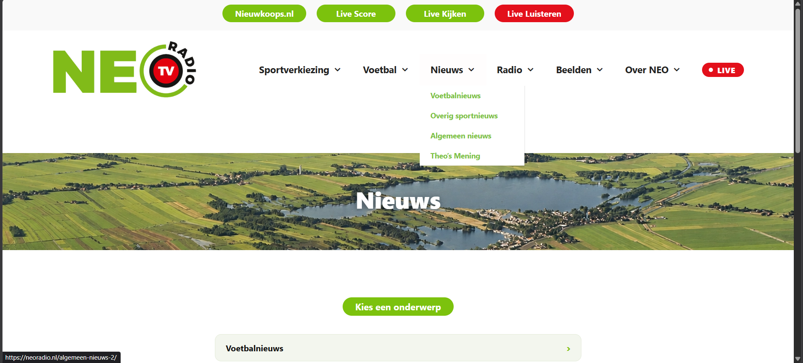

**Homepage (desktop en mobiel):**

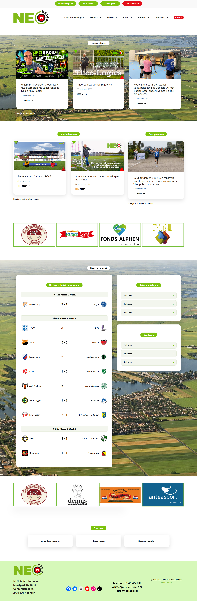 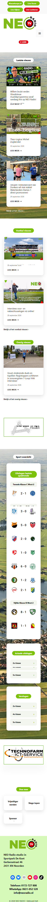

---

## 3. Logo en favicon

### Het logo

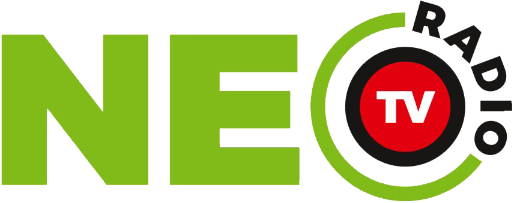

Bestand: [`logo/neo-radio-logo-transparant.png`](logo/neo-radio-logo-transparant.png)
(PNG, 856 × 339 px, transparante achtergrond)

**Opbouw van het logo:**

- **"NE"** in een zware, brede, schreefloze letter in **NEO-groen** (`#81BB19`).
- De **"O"** is een groene boog die om een **zwarte ring** (`#171614`) met een **rode cirkel**
  (`#E2000E`) loopt. In de rode cirkel staat **"TV"** in wit. De ring lijkt op een knop of een
  "on air"-lampje.
- **"RADIO"** staat in zwarte, vette kapitalen langs de rechterkant van de ring.
- Het logo combineert dus **radio én TV**: NEO Radio maakt ook video (live kijken, samenvattingen).

**Hoe het logo gebruikt wordt:**

| Plek | Gebruik |
| --- | --- |
| Header website | Linksboven, **275 px breed** (ongeveer 109 px hoog), op een witte achtergrond, klikbaar naar de homepage, alt-tekst "NEO RADIO" |
| Mobiel | Zelfde logo links onder de knoppen van de topbalk, met de menuknop (hamburger) rechts eronder |
| Footer | Linksboven in de lichtgroene footer, op elke pagina |
| Video-thumbnails | Rechtsboven in de afbeelding, op de foto |
| Kleding medewerkers | Het hoofdlogo op shirt en jas (zie de foto's in `beeldmateriaal/`) |
| Promo-afbeeldingen | Een andere variant: "NEO RADIO NIEUWKOOP" met equalizer-balkjes (zie hieronder) |

**Witruimte:** in het bestand zit bijna geen marge rond het logo (2 px). De witruimte moet dus door
de layout komen. In de header is dat de standaard-padding van het thema.

### Logovarianten die in gebruik zijn

| Variant | Waar gezien | Voorbeeld |
| --- | --- | --- |
| **NEO + TV-ring + RADIO** (hoofdlogo) | Header website, thumbnails, kleding medewerkers | [thumbnail interviews](beeldmateriaal/voorbeeld-nieuws-interviews-theo.jpeg) |
| **NEO + TV-ring, zonder "RADIO"** | Thumbnail voetbalsamenvatting, reclamebord bij het veld | [samenvatting Altior – NSV'46](beeldmateriaal/voorbeeld-voetbal-samenvatting-altior-nsv.png) |
| **"NEO RADIO NIEUWKOOP"** met equalizer-balkjes | Promo-afbeelding van een programma (ook op de microfoonkap en het shirt in die afbeelding) | [promo Willem bruist verder](beeldmateriaal/voorbeeld-nieuws-willem-bruist-verder.png) |
| **Alleen de ring ("knop")** | Favicon en app-icoon van de website | zie hieronder |

### Favicon / website-icoon

| Bestand | Afmeting | Gebruikt als |
| --- | --- | --- |
| [`logo/favicon-knop-150x150.png`](logo/favicon-knop-150x150.png) | 150 × 150 px | favicon (32 × 32) in het browsertabblad |
| [`logo/favicon-knop-349x341.png`](logo/favicon-knop-349x341.png) | 349 × 341 px | icoon 192 × 192 en Apple touch-icon (beginscherm iPhone) |

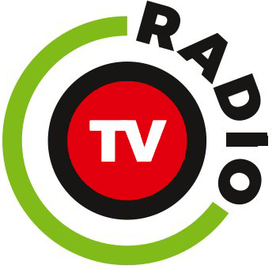

Het favicon is alleen de "O" van het logo: de groene boog, zwarte ring, rode cirkel met "TV" en het
woord "RADIO". Opvallend:

- Het grote bestand is **niet vierkant** (349 × 341 px) en wordt dus iets vervormd weergegeven.
- Het heeft een **witte achtergrond** (geen transparantie) en de ring loopt tot de rand.
- Op 16 of 32 px is het woord **"RADIO" niet meer leesbaar**.

---

## 4. Kleuren

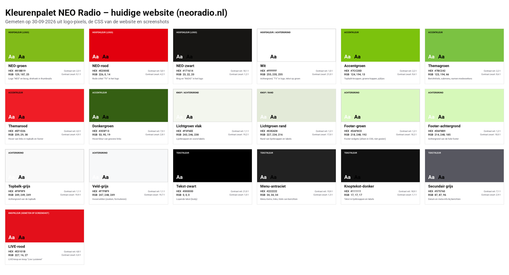

Van elke kleur staat een losse kleurstaal in [`kleuren/`](kleuren/). Op elke staal staan HEX, RGB,
waar de kleur gebruikt wordt en het contrast met witte en zwarte tekst.

### Hoofdkleuren (uit het logo)

| Staal | Naam | HEX | RGB | Gebruik |
| --- | --- | --- | --- | --- |
| 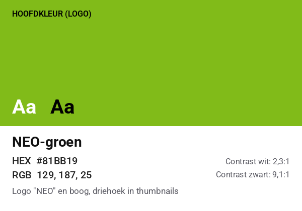 | NEO-groen | `#81BB19` | 129, 187, 25 | "NE" en de boog in het logo, groene driehoek in thumbnails |
| 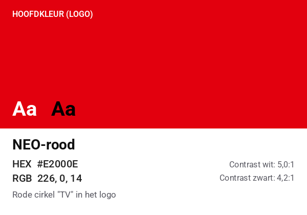 | NEO-rood | `#E2000E` | 226, 0, 14 | Rode cirkel "TV" in het logo, rode driehoek in thumbnails |
| 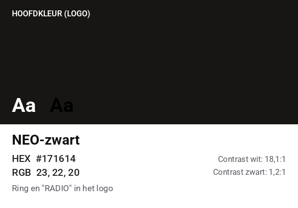 | NEO-zwart | `#171614` | 23, 22, 20 | Ring en "RADIO" in het logo |
| 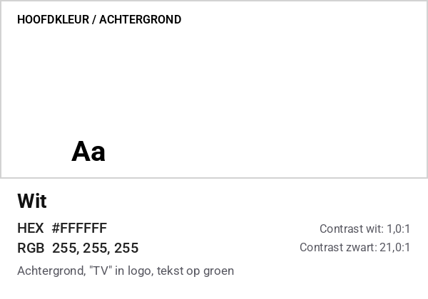 | Wit | `#FFFFFF` | 255, 255, 255 | "TV" in het logo, achtergrond van de site, tekst op groene labels |

### Accentkleuren (website)

| Staal | Naam | HEX | RGB | Gebruik |
| --- | --- | --- | --- | --- |
| 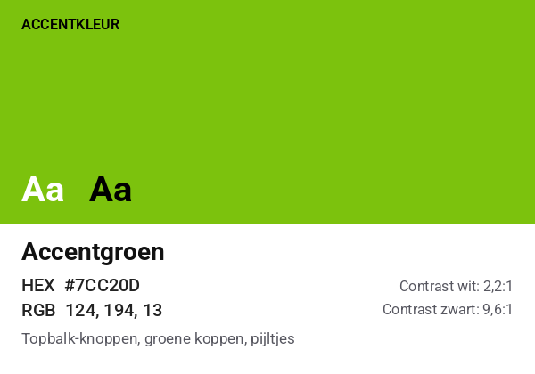 | Accentgroen | `#7CC20D` | 124, 194, 13 | Knoppen in de topbalk (Nieuwkoops.nl, Live Score, Live Kijken), groene sectiekoppen, hover van lijstknoppen, pijltjes ›, knop "Load More" |
| 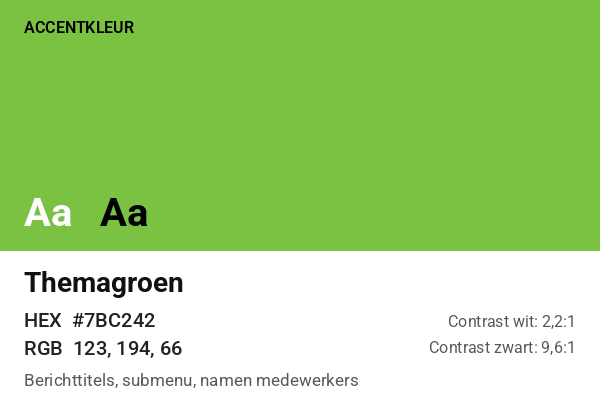 | Themagroen | `#7BC242` | 123, 194, 66 | Titel van een nieuwsbericht, submenu, namen van medewerkers, link "GeneratePress" in de footer |
| 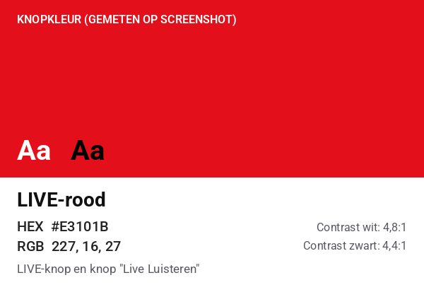 | LIVE-rood | `#E3101B` | 227, 16, 27 | Rode LIVE-knop in het menu en de knop "Live Luisteren" (gemeten op screenshot) |
| 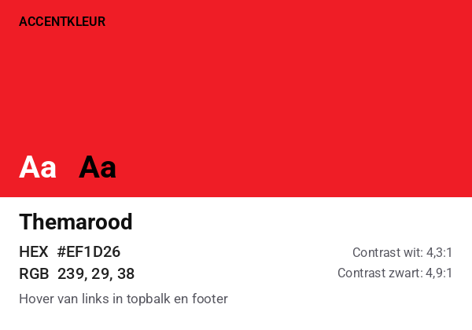 | Themarood | `#EF1D26` | 239, 29, 38 | Hover-kleur van links in topbalk en footer (alleen in CSS) |
| 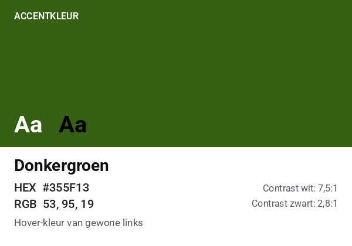 | Donkergroen | `#355F13` | 53, 95, 19 | Hover-kleur van gewone links |

### Achtergrondkleuren

| Staal | Naam | HEX | RGB | Gebruik |
| --- | --- | --- | --- | --- |
|  | Wit | `#FFFFFF` | 255, 255, 255 | Pagina, header, menu, kaarten |
| 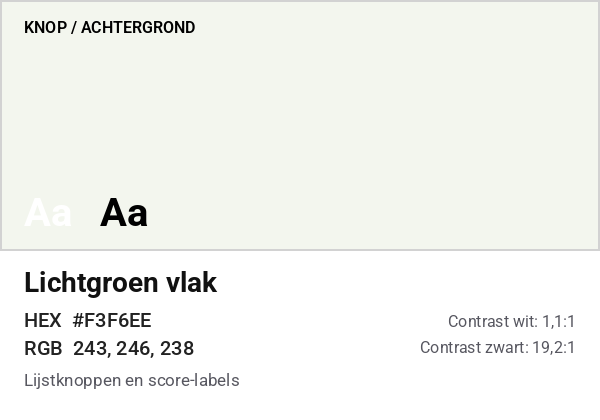 | Lichtgroen vlak | `#F3F6EE` | 243, 246, 238 | Lijstknoppen (klassen, onderwerpen) en score-labels |
| 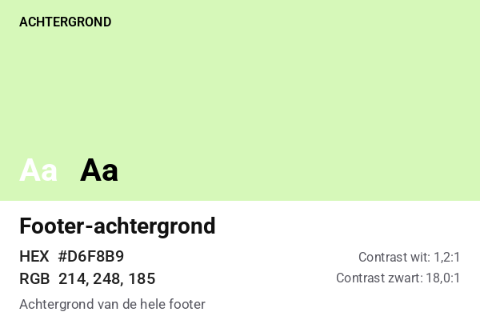 | Footer-achtergrond | `#D6F8B9` | 214, 248, 185 | Achtergrond van de hele footer, op elke pagina |
| 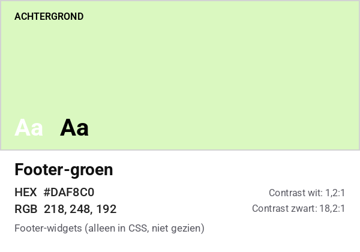 | Footer-groen | `#DAF8C0` | 218, 248, 192 | Staat in de CSS voor footer-widgets, maar is op de screenshots niet te zien |
| 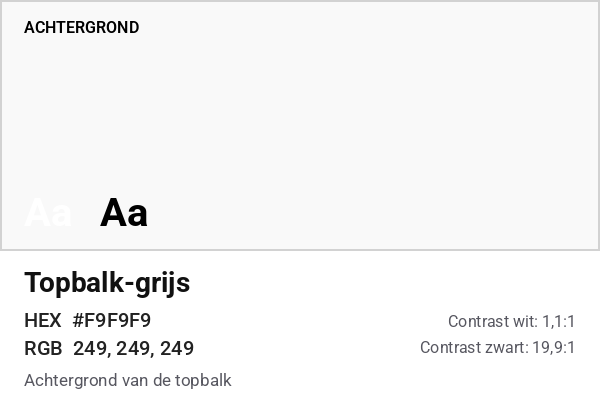 | Topbalk-grijs | `#F9F9F9` | 249, 249, 249 | Topbalk met de snelknoppen boven de header |
| 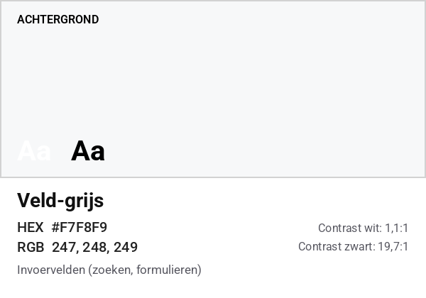 | Veld-grijs | `#F7F8F9` | 247, 248, 249 | Invoervelden (zoeken, formulieren) |
| — | Luchtfoto | — | — | [Luchtfoto van Nieuwkoop en de plassen](beeldmateriaal/achtergrond-neo-radio-website.webp) als achtergrond van grote secties |

### Tekstkleuren

| Staal | Naam | HEX | RGB | Gebruik |
| --- | --- | --- | --- | --- |
| 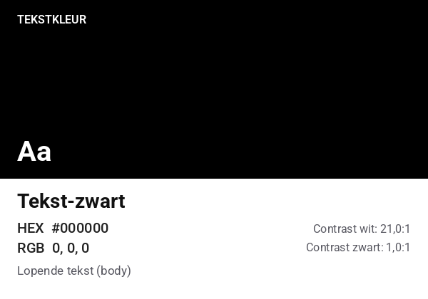 | Tekst-zwart | `#000000` | 0, 0, 0 | Lopende tekst |
| 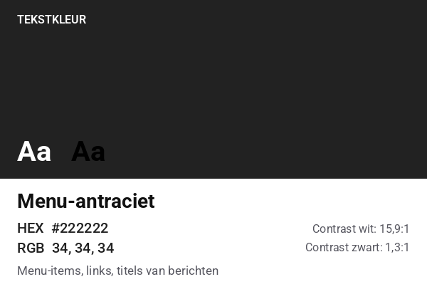 | Menu-antraciet | `#222222` | 34, 34, 34 | Menu-items, links, titels van berichten |
| 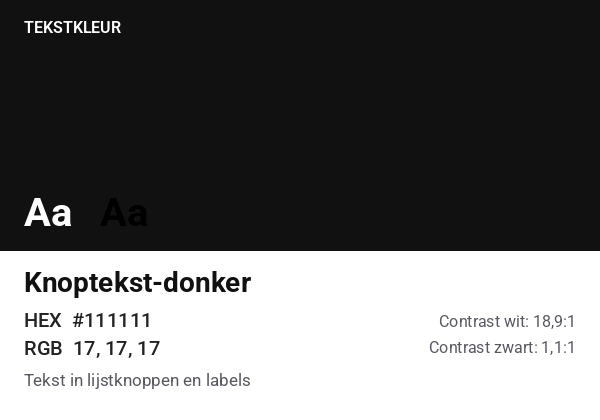 | Knoptekst-donker | `#111111` | 17, 17, 17 | Tekst in klasse-knoppen en score-labels |
| 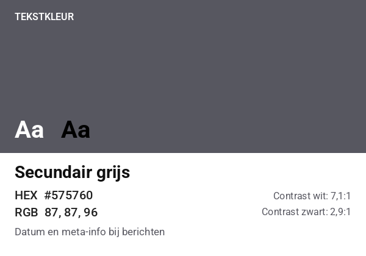 | Secundair grijs | `#575760` | 87, 87, 96 | Datum, auteur, categorieën en tags bij een nieuwsbericht; functies van medewerkers |

### Knopkleuren

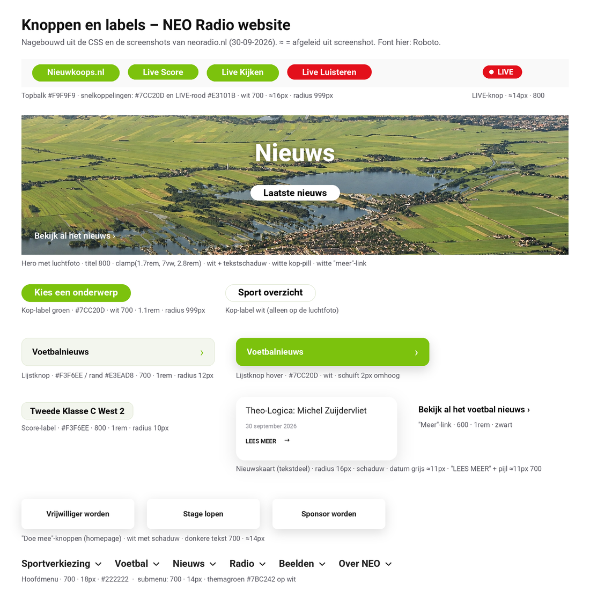

| Element | Achtergrond | Tekst | Rand | Hover |
| --- | --- | --- | --- | --- |
| Topbalk-knop ("Nieuwkoops.nl", "Live Score", "Live Kijken") | `#7CC20D` | `#FFFFFF` | — | — |
| Topbalk-knop "Live Luisteren" | `#E3101B` | `#FFFFFF` | — | — |
| LIVE-knop in het menu ("● LIVE") | `#E3101B` | `#FFFFFF` met witte stip | — | — |
| Sectiekop groen ("Kies een onderwerp", "Sponsoren") | `#7CC20D` | `#FFFFFF` | — | — |
| Sectiekop wit ("Laatste nieuws", op de luchtfoto) | `#FFFFFF` | `#000000` | — | — |
| Lijstknop ("Voetbalnieuws ›", "2e klasse ›") | `#F3F6EE` | `#111111`, pijl `#7CC20D` | `#E3EAD8` | achtergrond `#7CC20D`, tekst wit, schuift 2 px omhoog |
| Score-label ("Tweede Klasse C West 2") | `#F3F6EE` | `#111111` | `#E3EAD8` | — |
| "Doe mee"-knop ("Vrijwilliger worden") | `#FFFFFF` met schaduw | donker, vet | — | — |
| "LEES MEER →" op nieuwskaarten | geen | donker, vet, hoofdletters | — | — |
| "Meer"-link ("Bekijk al het nieuws ›") | geen | `#000000` of `#FFFFFF` op foto | — | onderstreept |
| Knop "Load More" (Live kijken) | `#7CC20D` | `#FFFFFF` | — | — |
| Sponsorvak | `#FFFFFF` | — | groen (≈ themagroen) | — |
| Standaardknop van het thema | `#F7F8F9` | `#FFFFFF` | — | tekst wordt ook `#F7F8F9`, dus onzichtbaar (zie zwakke punten) |

In de CSS staat ook nog een groen **datumlabel** (`#81BB19` met witte tekst). Dat is op de huidige
site niet meer te zien: de datum op nieuwskaarten is nu kleine grijze tekst.

Overige kleuren die **niet bij de huisstijl horen**: de social-media-iconen in de footer gebruiken de
kleuren van de platforms zelf (Facebook-blauw, YouTube-rood, Instagram-roze, TikTok-zwart). In de
code staan verder standaardwaarden van plug-ins: lichtblauw `#38B6FF` (menuknop in eigen CSS; niet
op de site gezien), blauw `#0073AA` (hover op berichttitels), turquoise `#00D1B2` (bolletjes van
de carrousel) en groen `#81D742` (agenda-plug-in).

### Controle met de screenshots

Op de originele screenshots (PNG, zonder compressie) zijn de grote kleurvlakken nagemeten, zoals
met een color picker. Ze komen exact overeen met de CSS.

| Onderdeel | Gemeten op screenshot | Waarde in de CSS |
| --- | --- | --- |
| Topbalk | `#F9F9F9` | `#F9F9F9` |
| Groene knoppen en koppen | `#7CC20D` | `#7CC20D` |
| Lijstknoppen | `#F3F6EE` | `#F3F6EE` |
| Footer | `#D6F8B9` | `#D6F8B9` |
| LIVE-knop en "Live Luisteren" | `#E3101B` | (deze CSS was niet op te halen) |

### Contrast en leesbaarheid

De richtlijn voor toegankelijke websites en apps (WCAG, niveau AA) vraagt een contrast van minimaal
**4,5:1** voor gewone tekst en **3:1** voor grote tekst.

| Combinatie | Contrast | Oordeel |
| --- | --- | --- |
| Zwart `#000000` op NEO-groen `#81BB19` | 9,1:1 | goed |
| NEO-zwart `#171614` op NEO-groen `#81BB19` | 7,8:1 | goed |
| Wit op NEO-groen `#81BB19` | 2,3:1 | **te laag** |
| Wit op accentgroen `#7CC20D` (sectiekoppen) | 2,2:1 | **te laag** |
| Themagroen `#7BC242` op wit (titel nieuwsbericht, submenu, namen) | 2,2:1 | **te laag** |
| Wit op NEO-rood `#E2000E` | 5,0:1 | goed |
| Wit op LIVE-rood `#E3101B` | 4,8:1 | goed |
| Wit op donkergroen `#355F13` | 7,5:1 | goed |
| Wit op standaardknop `#F7F8F9` | 1,1:1 | **onleesbaar** |

---

## 5. Typografie

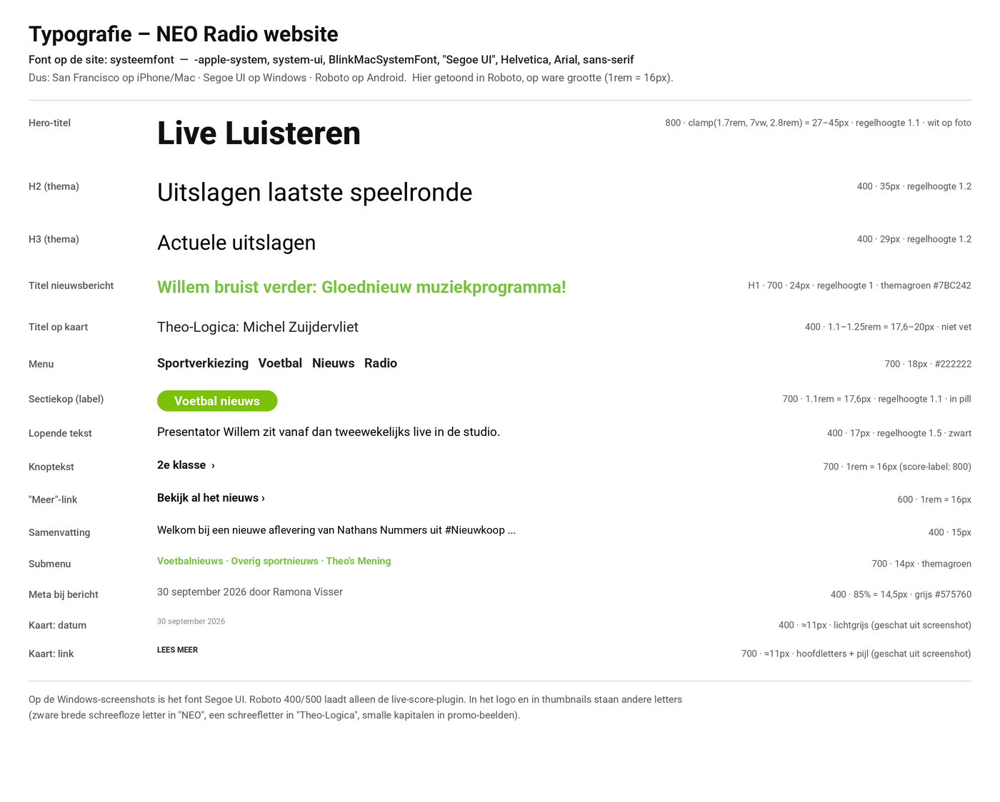

### Font

De website gebruikt **geen eigen webfont**, maar het **systeemfont** van het apparaat:

```css
font-family: -apple-system, system-ui, BlinkMacSystemFont, "Segoe UI", Helvetica, Arial, sans-serif;
```

Daardoor zie je op een iPhone of Mac **San Francisco**, op Windows **Segoe UI** en op Android
**Roboto**. De screenshots (gemaakt op Windows) bevestigen dit: de tekst staat in Segoe UI. Eén
uitzondering: de live-score-plug-in laadt zelf Roboto (400 en 500) via Google Fonts. Daardoor
staan de **teamnamen en uitslagen in Roboto**, terwijl de rest van dezelfde kaart in Segoe UI staat.

### Tekststijlen

| Rol | Grootte | Dikte | Regelhoogte | Kleur |
| --- | --- | --- | --- | --- |
| Hero-titel (nieuwe pagina's, bijv. "Live Luisteren") | `clamp(1.7rem, 7vw, 2.8rem)` = 27–45 px, schaalt mee met het scherm | 800 (extra vet) | 1,1 | wit met tekstschaduw, op de luchtfoto |
| Titel van een nieuwsbericht (H1) | 24 px | 700 (vet) | 1,0 | themagroen `#7BC242` |
| H2 (thema-standaard) | 35 px | 400 | 1,2 | zwart |
| H3 (thema-standaard) | 29 px | 400 | 1,2 | zwart |
| H4 / H5 (thema-standaard) | 24 / 20 px | 400 | — | zwart |
| Sectiekop in pill ("Laatste nieuws") | 1,1rem = 17,6 px | 700 | 1,1 | wit op groen of zwart op wit |
| Titel op nieuwskaart | 1,1–1,25rem = 17,6–20 px | 400 (niet vet, zie screenshots) | 1,1 | `#222222` |
| Datum op nieuwskaart | ≈ 11 px (geschat) | 400 | — | lichtgrijs |
| "LEES MEER →" op nieuwskaart | ≈ 11 px (geschat) | 700, hoofdletters | — | donker |
| Datum en auteur bij een bericht | 85% = 14,5 px | 400 | 1,5 | grijs `#575760` |
| Lopende tekst | 17 px | 400 | 1,5 | zwart |
| Samenvatting onder bericht | 15 px | 400 | — | zwart |
| Hoofdmenu | 18 px | 700 | — | `#222222` |
| Submenu | 14 px | 700 | — | themagroen `#7BC242` |
| Knoppen in de topbalk | ≈ 16 px (geschat) | 700 | — | wit |
| LIVE-knop | ≈ 14 px (geschat) | 800, hoofdletters | — | wit |
| Lijstknop | 16 px (1rem) | 700 | — | `#111111` |
| Score-label | 16 px (0,95rem op mobiel) | 800 | 1,3 | `#111111` |
| "Meer"-link | 16 px | 600 | — | zwart of wit |
| Naam medewerker | ≈ 17 px (geschat) | 700 | — | themagroen |
| Standaardknop (thema) | 17 px, padding 10 × 20 px | 400 | — | — |

Waarden met ≈ zijn afgeleid uit de screenshots, omdat die CSS niet op te halen was. Jouw scherm
stond op 125% zoom; dat is in de schatting meegenomen.

### Letters in het logo en in beeld

- **Logo:** "NEO" is een zware, brede schreefloze letter met rechte afsnijdingen; "RADIO" is een
  vette, ronde schreefloze letter. Het logo is een afbeelding, dus het exacte font is niet uit de
  website te halen. Dit moet bij NEO Radio nagevraagd worden.
- **Thumbnails en promo's** gebruiken steeds andere letters: een klassieke schreefletter
  ("Theo-Logica"), een schuine schreefloze letter (interviews), smalle kapitalen en een
  kwast-handschrift (promo "Willem bruist verder"). Er is dus geen vaste letter voor beeldmateriaal.

---

## 6. Beeldgebruik en iconen

### Foto's en afbeeldingen

| Soort | Stijl | Voorbeeld |
| --- | --- | --- |
| **Achtergrond** | Luchtfoto van Nieuwkoop met de Nieuwkoopse Plassen en groene polders. Staat over de volle breedte achter de grote secties. Het groen sluit goed aan bij de huisstijlkleur. | [achtergrond](beeldmateriaal/achtergrond-neo-radio-website.webp) |
| **Nieuwsfoto's** | Eigen sportfotografie, deels met een professionele camera (Canon EOS R5) en deels met een telefoon. Formaat 16:9 (2560 × 1440 px). Echte mensen uit de regio: spelers, trainers, lopers. | [7-Loop](beeldmateriaal/voorbeeld-nieuws-7-loop.jpg), [volleybal](beeldmateriaal/voorbeeld-nieuws-volleybal-bas-donkers.jpeg) |
| **Video-thumbnails** | Vast sjabloon: **groene driehoek linksboven**, **rode driehoek rechtsonder**, logo rechtsboven, grote witte tekst met schaduw op de foto. Ook de video's op *Live kijken* gebruiken dit sjabloon, vaak met een groen balkje met de programmanaam. Herkenbaar en consequent. | [Theo-Logica](beeldmateriaal/voorbeeld-nieuws-theo-logica.jpg), [interviews](beeldmateriaal/voorbeeld-nieuws-interviews-theo.jpeg), [samenvatting](beeldmateriaal/voorbeeld-voetbal-samenvatting-altior-nsv.png) |
| **Promo-afbeeldingen** | Druk en sterk bewerkt: veel gloed, neon-groen, meerdere lettertypes, een ander logo. Wijkt af van de rest. | [promo Willem](beeldmateriaal/voorbeeld-nieuws-willem-bruist-verder.png) |
| **Medewerkers** | Portretfoto op een lichte achtergrond, rond uitgesneden met een groene rand. Staat in een witte kaart met afgeronde hoeken en schaduw, met de naam in groen en de functies in grijs eronder. De medewerkers dragen kleding met het NEO-logo. | [medewerker](beeldmateriaal/voorbeeld-medewerker-theo.png) |
| **Sponsors** | Ongeveer 35 logo's van lokale bedrijven. Onderaan elke pagina staat een carrousel met witte vakken met een dunne groene rand: 4 naast elkaar op desktop, 1 op mobiel. | — |
| **Clublogo's** | Bij de uitslagen staat van elke club het logo. Kwaliteit en formaat wisselen sterk. | — |

De kleuren in de thumbnails zijn gemeten: de groene driehoek is `#83BB26` en de rode `#E30C14`.
Dat zijn de logokleuren `#81BB19` en `#E2000E` met een kleine afwijking door JPEG-compressie.

### Iconen

- **Pijltje "›"** als tekstteken achter links en in de klasse-knoppen (in `#7CC20D`).
- **Voetbal-icoon** (16 × 16 px) bij doelpunten in de live score:
  
  ([`icoon-goal.png`](beeldmateriaal/icoon-goal.png)).
- **Menu-iconen** (hamburger, dropdown-pijltjes, zoeken) uit het icoon-font van het thema. Op
  mobiel staat de hamburger in een lichtgrijs vierkant; het open menu sluit met een ×.
- **Witte stip** in de rode LIVE-knop, als "on air"-lampje.
- **Social-media-iconen** in de footer: ronde iconen in de kleuren van de platforms zelf
  (Facebook, Bluesky, e-mail, YouTube, Instagram en TikTok).
- **Map- en label-icoontjes** in grijs bij de categorieën en tags onder een nieuwsbericht.
- In de promo-afbeelding staan lijn-iconen in groene cirkels (muzieknoot, microfoon, mensen,
  zendmast). Die stijl komt op de website zelf niet terug.

---

## 7. Layout en navigatie

### Opbouw van de pagina's

Bijna elke pagina heeft dezelfde vaste opbouw:

1. **Topbalk** (lichtgrijs) met vier ronde knoppen: *Nieuwkoops.nl*, *Live Score* en *Live Kijken*
   in groen, en *Live Luisteren* in rood.
2. **Header** (wit): logo links, hoofdmenu rechts, en helemaal rechts een rode **● LIVE**-knop.
   Het submenu klapt bij hover open als een witte lijst met groene tekst.
3. **Hero:** de luchtfoto met een grote witte paginatitel in het midden ("Nieuws", "Voetbal",
   "Medewerkers").
4. **Inhoud** onder een groene of witte sectiekop in pill-vorm.
5. **Sponsoren:** groene kop "Sponsoren" met een carrousel van logo's.
6. **Footer** (lichtgroen `#D6F8B9`): logo, adres van de studio (Sportpark De Koet, Gerberastraat
   46, Noorden), social-media-iconen, telefoon, WhatsApp en e-mail, en "© 2026 NEO RADIO • Gebouwd
   met GeneratePress".

Verder:

- **Maximale breedte** van de inhoud: 1400 px, gecentreerd.
- **Kaarten:** nieuwsberichten, uitslagen en medewerkers staan in witte kaarten met **afgeronde
  hoeken (16 px)** en een zachte schaduw (`0 10px 30px rgba(0,0,0,.12)`). Bij hover schuift een
  kaart 4 px omhoog.
- **Nieuwskaart:** foto (16:9) bovenaan, daaronder de titel (niet vet), een kleine grijze datum en
  "LEES MEER →".
- **Veel witruimte** tussen de secties; de inhoud staat gecentreerd.

### Homepage (van boven naar beneden)

1. Topbalk en header met LIVE-knop
2. Luchtfoto-sectie met witte kop **"Laatste nieuws"**: 3 nieuwskaarten naast elkaar en
   "Bekijk al het nieuws ›" in wit
3. Twee kolommen (2/3 en 1/3): **"Voetbal nieuws"** (2 kaarten) en **"Overig nieuws"** (1 kaart)
4. Carrousel met sponsorlogo's
5. Luchtfoto-sectie **"Sport overzicht"** met witte kaarten: *Uitslagen laatste speelronde* (per
   klasse een score-label, met per wedstrijd clublogo, naam en uitslag), *Actuele uitslagen* en
   *Verslagen* (lijstknoppen per klasse)
6. Carrousel met sponsorlogo's
7. **"Doe mee"** met drie witte knoppen: *Vrijwilliger worden*, *Stage lopen* en *Sponsor worden*
8. Footer

### Andere pagina's

| Pagina | Opbouw |
| --- | --- |
| **Nieuws** | Hero "Nieuws", groene kop "Kies een onderwerp" en 4 lijstknoppen: Voetbalnieuws, Overig sportnieuws, Theo's Mening, Algemeen nieuws |
| **Live score** | Hero "Voetbal", een lange groene kop "Zaterdag 26 september zijn de volgende competitiewedstrijden", één witte kaart met alle uitslagen per klasse (per wedstrijd: logo, naam, score, naam, logo) en daaronder "Voetbal nieuws" (3 kaarten) |
| **Nieuwsbericht** | Geen hero. Grote afbeelding bovenaan, groene titel, grijze regel "30 september 2026 door Ramona Visser", tekst in één smalle kolom, categorieën en tags met icoontjes, en een link naar het vorige bericht |
| **Live kijken** | Hero "Live kijken", groene kop "Video's", een grote YouTube-speler, een raster van video's (3 naast elkaar) met titel en korte tekst, en de knop "Load More" |
| **Live luisteren** | Hero "Live Luisteren" en daaronder alleen de standaard audiospeler van de browser (grijze balk met play-knop) |
| **Medewerkers** | Hero "Medewerkers" en 4 witte kaarten naast elkaar met ronde foto, groene naam en grijze functies |

### Menu ("Menu 2026")

| Hoofdmenu | Submenu |
| --- | --- |
| Sportverkiezing | Voordrachtformulier, Reglement, Fotogalerij |
| Voetbal | 2e klasse, 4e klasse, 5e klasse, Live Score |
| Nieuws | Voetbalnieuws, Overig sportnieuws, Algemeen nieuws, Theo's Mening |
| Radio | Terug luisteren, live luisteren, Programmering |
| Beelden | Live kijken, Terug kijken, Samenvattingen, Oude samenvattingen, Nieuwsberichten |
| Over NEO | Medewerkers |

Het submenu klapt open bij hover (desktop). De rode LIVE-knop staat los achter het menu.

### Mobiel

Wat de screenshots en de CSS laten zien:

- De **topbalk** zet de vier knoppen in twee rijen van twee.
- Daaronder staat het **logo**, met rechts eronder de **hamburgerknop** (in een lichtgrijs vierkant)
  en daaronder gecentreerd de rode **LIVE-knop**.
- Het **open menu** is een lijst over de volle breedte, met lichtgrijze rijen, een pijltje per
  onderdeel om het submenu te openen, en een × om te sluiten.
- Alles komt **onder elkaar** te staan: nieuwskaarten, uitslagen, medewerkers en sponsors
  (1 logo tegelijk). De "Doe mee"-knoppen staan in twee kolommen.
- Bij de **uitslagen verdwijnen de teamnamen**: je ziet per wedstrijd alleen twee clublogo's en de
  score.
- De **footer** staat gecentreerd onder elkaar: logo, adres, iconen, contactgegevens.
- De kop (topbalk, logo, menuknop en LIVE-knop) is op mobiel zo'n **400–420 px hoog** (gemeten op
  de mobiele screenshots van 349 px breed). Op een gewone telefoon is dat ruim de helft van het
  eerste scherm, voordat je iets van de inhoud ziet.
- Volgens de CSS gaat het menu tot en met **768 px** schermbreedte over op de hamburgerknop, en wordt
  de witruimte rond de inhoud dan 30 px in plaats van 40 px.

---

## 8. Tone of voice

NEO Radio spreekt de lezer **informeel** aan, met **je/jij/jou** (nooit "u"). De toon is
**enthousiast, lokaal en gezellig**.

Voorbeelden van de website:

> "Presentator Willem zit vanaf dan tweewekelijks op woensdagmorgen tussen 10:00 en 12:00 uur live
> in de studio om jouw week te voorzien van een flinke dosis muzikale energie!"

> "Met de start van dit nieuwe programma haal je de ultieme sound in huis of op de werkvloer."

> "Dus, noteer woensdagmorgen om 10:00 uur in de agenda, zet de radio aan en bruis lekker mee met
> Willem!"

Kenmerken:

- **Motto: "Voor en door jou".** Dit staat letterlijk in berichten en in de promo-afbeelding
  ("Voor jou en door jou").
- **Veel uitroeptekens** en sterke woorden in koppen: *gloednieuw*, *zinderende duels*,
  *topsfeer*, *Mét interviews!*
- **Lokaal:** plaatsnamen, clubs en mensen uit de gemeente Nieuwkoop staan centraal.
- **Soms Engelse woorden** (*vibe*, *sound*) en een Engelse knop van een plug-in (*Load More*).
- **Wisselende schrijfwijze:** "NEO RADIO" en "NEO Radio", "live luisteren" en "Live Luisteren".

---

## 9. Doelgroep

- **Inwoners van de gemeente Nieuwkoop** (Nieuwkoop, Noorden, Nieuwveen, Zevenhoven en omgeving)
  die lokaal nieuws willen.
- **Liefhebbers van amateursport**, vooral voetbal: spelers, trainers, ouders en supporters van
  clubs als Nieuwkoop, Altior, NSV'46 en Zevenhoven.
- **Luisteraars van lokale radio**. Gezien de muziekkeuze (60's tot 80's, rock, blues) lijkt de
  radio vooral op volwassenen gericht.
- **Jongeren**, via de jeugd-TikTok (`@neo.jeugd`) en stageplekken.
- **Lokale ondernemers** als sponsor, en mensen die vrijwilliger willen worden.

---

## 10. Sterke en zwakke punten

### Sterke punten

- **Herkenbaar, fris groen** dat in logo, website en thumbnails terugkomt.
- **Krachtig logo** met drie heldere kleuren (groen, zwart, rood); de ring werkt ook los als icoon.
- **Live is altijd één klik weg:** de snelknoppen in de topbalk en de rode LIVE-knop staan op
  elke pagina. Rood wordt consequent gebruikt voor alles wat live is.
- **Vaste, voorspelbare opbouw** van elke pagina: topbalk, header, hero, inhoud, sponsors, footer.
- **Sterke lokale identiteit** door de luchtfoto van Nieuwkoop en de Nieuwkoopse Plassen.
- **Moderne kaartstijl** op de vernieuwde pagina's: afgeronde hoeken, zachte schaduwen, subtiele
  hover-animaties.
- **Duidelijke sectiekoppen** in pill-vorm, en overzichtelijke knoppen per voetbalklasse.
- **Herkenbaar thumbnail-sjabloon** (groene en rode driehoek met logo) en goede eigen fotografie.
- **Veel actuele eigen content**: nieuws, uitslagen, interviews, video's.
- **Persoonlijke tone of voice** met een duidelijk motto: "Voor en door jou".
- **Systeemfont** zorgt voor een snelle site die op elk apparaat vertrouwd leest.

### Zwakke punten

- **Te veel verschillende groentinten:** `#81BB19` (logo), `#7CC20D` (knoppen, koppen) en
  `#7BC242` (titels, submenu). Ook drie roodtinten: `#E2000E` (logo), `#E3101B` (LIVE-knoppen) en
  `#EF1D26` (hover in het thema).
- **Te weinig contrast:** witte tekst op groen (2,2–2,3:1), zoals op de topbalk-knoppen en
  sectiekoppen, en groene tekst op wit (2,2:1), zoals de titel van een nieuwsbericht en de namen van
  medewerkers. Dat is moeilijk te lezen, vooral buiten in de zon of voor slechtzienden.
- **Verkeerd ingestelde standaardknop** in het thema: witte tekst op bijna-wit (1,1:1).
- **Mobiel is de kop erg groot:** topbalk, logo, menuknop en LIVE-knop nemen ongeveer de helft van
  het eerste scherm in.
- **Live luisteren past op mobiel niet in het scherm:** op de screenshot vallen de menuknop, de
  audiospeler en de social-iconen rechts buiten beeld.
- **Uitslagen op mobiel zonder teamnamen:** je ziet alleen clublogo's en de score. Wie de logo's
  niet kent, weet niet welke clubs er spelen.
- **De hero is niet overal even breed:** op *Live kijken* en *Live luisteren* is de luchtfoto zo
  breed als de inhoud, op de andere pagina's loopt hij over de volle breedte.
- **Twee fonts in de uitslagen:** teamnamen en scores staan in Roboto (van de plug-in), de rest in
  Segoe UI.
- **Aanvangstijd in de teamnaam:** in de uitslagen staat de aanvangstijd in de naam van de club
  ("Sportief (15.00 uur)"), en één keer is die onvolledig ("SIVEO'60 (15.00").
- **Geen vaste letter:** het systeemfont ziet er op elk apparaat anders uit, de letter van het logo
  komt nergens terug, en thumbnails en promo's gebruiken steeds andere fonts.
- **Meerdere logovarianten** naast elkaar ("NEO TV", "NEO RADIO NIEUWKOOP") en het logo is alleen
  als PNG op de site aanwezig, niet als SVG.
- **Favicon niet vierkant**, met een witte achtergrond, en "RADIO" is op klein formaat onleesbaar.
- **Onafgemaakte onderdelen:** de knoppen bij "Doe mee" lijken naar een tijdelijke
  "we zijn nog bezig"-pagina te gaan, en er staan veel oude en dubbele pagina's
  (bijv. `/live-kijken-4/`, `/home-kopieren/`).
- **Diep menu:** 6 hoofdonderdelen met 1 tot 5 subitems. Live Score staat zowel bij de
  snelkoppelingen als onder Voetbal. Op mobiel moet je daardoor veel tikken.
- **Live luisteren is een kale standaard audiospeler** van de browser, zonder informatie over wat
  er nu op de radio is. Verder is de pagina leeg.
- **Sponsor- en clublogo's hebben geen alt-tekst**, wat slecht is voor blinde en slechtziende
  bezoekers.

---

## 11. Conclusie: wat nemen we mee naar de app?

De huisstijl van NEO Radio draait om **het groene logo met de rode TV-knop**, een **lokale,
enthousiaste toon** en de **vernieuwde kaartstijl** van de homepage. Die kenmerken nemen we over. De
zwakke punten (te veel tinten, te weinig contrast, geen vaste letter) lossen we in de app op.

### 1. Kleuren: terug naar de logokleuren

Voorstel voor het app-palet:

| Rol in de app | Kleur | HEX | Waarom |
| --- | --- | --- | --- |
| Hoofdkleur | NEO-groen | `#81BB19` | Exact de kleur van het logo; één groen in plaats van drie |
| Groen voor witte tekst en knoppen | Donkergroen | `#355F13` | Staat al op de site; wit erop haalt 7,5:1 (minimaal nodig: `#5A8211`, 4,5:1) |
| Live-accent | NEO-rood | `#E2000E` | De site gebruikt rood al voor alles wat live is; we kiezen één rood, dat van het logo. Wit erop haalt 5,0:1 |
| Tekst en donkere vlakken | NEO-zwart | `#171614` | Kleur van het logo; ook goed leesbaar op groen (7,8:1) |
| Achtergrond | Wit | `#FFFFFF` | Rustig en duidelijk |
| Kaarten en knoppen | Lichtgroen vlak + rand | `#F3F6EE` / `#E3EAD8` | Zelfde zachte stijl als de lijstknoppen op de site |
| Secundaire tekst | Secundair grijs | `#575760` | Voor datums en meta-info (7,1:1 op wit) |

Belangrijkste regel: **op groen komt zwarte tekst**, of we gebruiken het donkergroen als er witte
tekst op moet.

### 2. Typografie

- Gebruik in de app het **systeemfont** (San Francisco op iOS, Roboto op Android). Dat sluit aan
  bij de website, voelt vertrouwd op elk toestel en vraagt geen licentie.
- Neem de **tekstschaal van de site** als basis: titel 28–34 px (800), koppen 20 px (700),
  tekst 17 px (400), knoppen 16 px (600–700), kleine tekst 12–14 px. De datum op de kaarten van de
  site (≈ 11 px) is te klein voor een app.
- Nog te bespreken: een zware display-letter voor grote titels die lijkt op de letter van "NEO"
  in het logo.

### 3. Componenten die we overnemen

- **Kaarten** met afgeronde hoeken (16 px) en een zachte schaduw voor nieuws, uitslagen en
  medewerkers.
- **Pill-labels** voor sectiekoppen.
- **Rode LIVE-knop met witte stip** ("on air"-lampje) voor de live-uitzending.
- **Lijstknoppen met pijltje ›** (zoals "Voetbalnieuws ›" en "2e klasse ›") voor keuzes.
- **Score-regels** met clublogo, naam en uitslag, gegroepeerd onder een label per klasse. Anders
  dan op de mobiele site houden we de **teamnaam altijd zichtbaar**.

### 4. Beeld

- De **luchtfoto van Nieuwkoop** als achtergrond van de bovenkant van het homescherm en het
  Info-scherm.
- **16:9-thumbnails** met het bestaande sjabloon (groene en rode driehoek) gebruiken voor video's.
- **Ronde profielfoto's met groene rand** voor presentatoren en medewerkers.
- **Clublogo's** bij de live score.

### 5. Logo en app-icoon

- Het **volledige logo** op het startscherm (splash) en in het Info-scherm.
- Het **app-icoon** baseren op de ring ("knop"), maar opnieuw opgebouwd: vierkant, scherp en
  zonder het kleine woord "RADIO".
- NEO Radio vragen om het **originele logobestand** (SVG of AI) en welke logovariant leidend is.

### 6. Navigatie

In plaats van het diepe websitemenu een **tabbalk onderin** met de onderdelen uit de opdracht:
**Home, Live score, Nieuws, Live (luisteren/kijken) en Info**. "Live" krijgt een rode markering,
zodat de live-uitzending altijd één tik weg is, net als de snelknoppen en de LIVE-knop op de site.
Bovenin houden we alleen een **smalle balk met het logo**. Zo ontstaat niet hetzelfde probleem als
op de mobiele site, waar de kop de helft van het scherm inneemt.

### 7. Tone of voice

Informeel met **je/jij**, enthousiast en lokaal, met het motto **"Voor en door jou"**. Alle
teksten consequent in het **Nederlands** (dus geen "Load More") en één schrijfwijze: **NEO Radio**.

### 8. Toegankelijkheid

Alle tekst minimaal **4,5:1 contrast**, alt-teksten bij logo's en foto's, en knoppen die groot
genoeg zijn om goed op te tikken (minimaal 44 × 44 px).

### Vragen voor NEO Radio

1. Is er een huisstijlhandboek of zijn er vaste kleurcodes?
2. Welke groentint is "officieel": die van het logo (`#81BB19`) of die van de website (`#7CC20D`)?
3. Mogen we het logo als SVG of AI-bestand krijgen, en welk font zit er in het logo?
4. Welke logovariant is leidend: NEO RADIO (met TV-ring), NEO TV of NEO RADIO NIEUWKOOP?

### Aandachtspunten voor de bouw

- De website zit achter een **beveiligingscontrole** die automatische bezoekers tegenhoudt. Tijdens
  dit onderzoek werden daardoor ook verzoeken naar de WordPress-API (`/wp-json/`) tegengehouden. De
  app moet straks nieuws en uitslagen van de website ophalen. Dit moeten we vroeg met NEO Radio en
  hun hostingpartij bespreken, zodat de app wel bij de gegevens kan.
- In de uitslagen staat de **aanvangstijd in de teamnaam** ("Sportief (15.00 uur)"). Als de app die
  gegevens overneemt, moet de tijd er apart uit gehaald worden, of NEO Radio vult hem voortaan in
  een eigen veld in.

---

## Bestanden in deze map

| Map | Inhoud |
| --- | --- |
| [`screenshots/`](screenshots/) | 16 screenshots: 8 pagina's, elk op desktop en mobiel |
| [`logo/`](logo/) | Logo (PNG, transparant) en twee favicon-bestanden |
| [`kleuren/`](kleuren/) | 19 kleurstalen, een overzicht van het palet en de knopstijlen |
| [`typografie/`](typografie/) | Overzicht van alle tekststijlen op ware grootte |
| [`beeldmateriaal/`](beeldmateriaal/) | Achtergrondfoto, voorbeeld-nieuwsbeelden, thumbnails, medewerkersfoto, goal-icoon |
